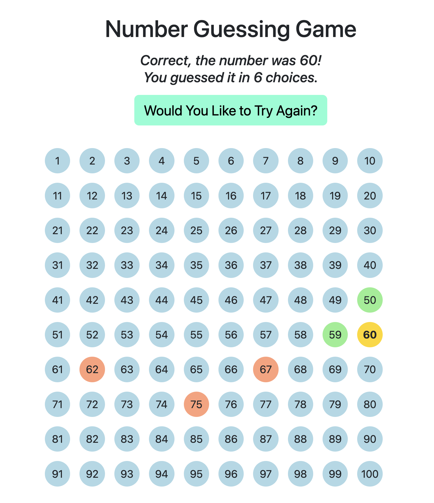

# 📋 Project 2

## ⚡ Quickstart

### MacOS / WSL / Linux / ChromeOS

Clone the repository (replacing `USERNAME`):

```bash
git clone https://github.iu.edu/i365sp2025/USERNAME-project-2.git
cd USERNAME-project-2
```

## 🎰 Revise your number guessing game by adding a more complex interface

This time, your interface still needs to have similar feedback / functionality:

- Is the number chosen too high, too low or correct?
- How many attempts were needed?
- Do you want to play again?

You'll no longer need to error check your input. Nor do you necessarily need to tell the user what number was selected because they will now be able to see their current and previous choices.

### Instead of an input, we'd like you to add an interface made up of 100 clicakable numbers.

- `Buttons` for the numbers from 1-100
- Numbers should `change color` to indicate their status (too high, too low, correct)
- `Hover effects and pointers` to indicate items can be interacted with
- Once a `number is clicked`, it shouldn't be able to be messed with again until the game is reset
- The interface should `responsive` => Be able to handle someone making the screen wider or narrower (within reason)

#### When the user guesses the correct number:

- A `try again` or `play again` button should appear (or become un-disabled)
- The interface and logic for the game is `reset`
- The button should then go back to `being disabled / not visible`
- After a correct guess, but before the user clicks `try again/play again`, if a user interacts with the numbers, this should not have any effect on the game. (i.e. you can't choose another number once you've chosen the correct number) (Sure, ideally all interface interactions would be turned off, but mostly we just want to make sure that nothing happens if a user clicks on a button after a correct click, but before playing again.)

You may use `Bootstrap`, your `own CSS`, or any `code snippets` that are useful (button styling for example). We are looking for an organized, clearly communicated interface with good hierarchy and spacing. The color choices matter for the buttons -- you'll need to make a choice for a `too high`, `too low` and `correct` effect. The design doesn't have to be fancy, or even pretty -- generic is ok -- but it should look professional.



## 📋 Expectations in Your Code

### We are expecting these main functions:

```js
function createBoard() {} // optional parameter for how large a board to create
function guessNumber(event) {} // takes an event from the number being clicked on
function tryAgain() {} // connected to a button
(function () {
  createBoard();
  // add event listeners here
})();
```

You are welcome to use as many helper functions as you need.

### This is how numbers should be set up / accessed:

```html
<div class="num" data-number="30">30</div>
```

- Yes, I know you can just grab the number with the text content, but we'd like to see you grab this value from the _dataset_ (off of data-).
- No, we don't really care if you change the name of the the class or the data attribute on this HTML to match what makes sense to you, but do use the function names as suggested above

## 📝 Expectations in Your Work

- Create your project `individually`. It is not a group assignment, nor an `AI and me` assignment.
- Use `functions, good naming and syntax conventions, and comments` as needed
- If you look up code / techniques we have not introduced in class, it would be wise to `explain in a comment` what you are doing, why, and link to where you learned it
- Make a `local clone` of your Project 2 repository
- Submit your work by `commiting and syncing` with your IU Github repository by the deadline

## 🧭 Recommended Steps

1.  Make the interface first (including necessary CSS) and check that you can grab the data on click from each number

2.  Next, add in the JS logic from your previous game - you may consider rewriting this code, but referring to your Project 1 for the algorithm

3.  Finally, add additional CSS (& JS) needed to complete the interface for that initial round of the game

4.  Add a button for the user to play the game again, and figure out how to reset both the interface and the logic

5.  Remember, test often, test along the way, and test after you’re done!

## BONUS (2 pts)

Create an interface element (a button attached to an input or a prompt, radio buttons, slider, etc...) that allows the user to change the range for the game. So instead of 1-100, perhaps the user would like to do 1-50. This should be an option BETWEEN rounds, but not during game play.

The interface should adjust to accommodate more/fewer elements on the screen. The game play should adjust to handle the logic for the adjusted range.

Best of luck!

## 🏆 Submission

Push your changes to Github (Replacing `COMMIT_MESSAGE`) and submit your repository link on Canvas

```bash
git add .
git commit -m <COMMIT-MESSAGE>
git push
```

## Rubric

|              | Maximum Points | Description                                      |
| -----------: | :------------: | :----------------------------------------------- |
|    interface |       25       | HTML and CSS design and interactions as expected |
|  createBoard |       30       | Creates game board                               |
|  guessNumber |       30       | Handles game logic                               |
|     tryAgain |       10       | Replays the game                                 |
|         IIFE |       5        | Jumpstart the game / global namespace clear      |
| range change |       +2       | Bonus (optional)                                 |
|              |                |                                                  |
|    **Total** |    **100**     | (102 with both bonuses)                          |
