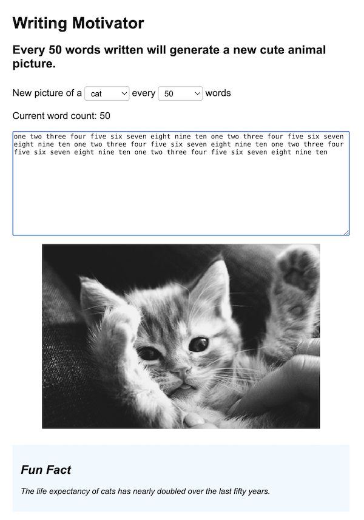

# Project 4

## Goal 🐈‍⬛ 🐈 🐕 🐩

Create a Writing Motivator app (like _Written Kitten_) to increase motivation to get your writing done. For every 50 words (or more) entered, display a new cat or dog image, and a "fun fact" about that pet. 

## Directions

-   TITLE & DIRECTIONS: Provide an HTML & CSS interface that includes a title (H1) and directions (P) - the directions should update to say how many words it takes to get to a new one. For example, _"Every 50 words written will generate a new cute animal picture."_
-   USER INTERFACE: Using form elements, give the user a choice of cat or dog, and a way to set the number of words before a new image appears to at least four different values. One of those should be 50. We used 50, 100, 200 and 500.
-   USER INTERFACE: Include a **text area** form element for writing in
-   FEEDBACK: Provide a **word count** that updates as the user types
-   FEEDBACK: An **image placeholder** for where the pet image will appear
-   FEEDBACK: Plus an area to display a **"fun fact"** ("Fun Fact" H2)
-   DATA STORAGE: If the user refreshes the page, their essay should not disappear (local storage)

## Expectations

-   SPACES should NOT count as words, but other characters can
-   If the limit is 50 for a new image, and the user goes over 50 words then deletes a few words back to 47, the same image remains. 
-   Limits are set from zero, not where the current count is. So if I'm at 50 words and my limit is 50 and I then change the limit to 100, I'll get a new image at 100 and again at 200. (Not 150 and 250)
-   The user interface should be responsive, meaning it fits well in a narrow viewport, and also in a wider one.
-   You get to decide how the interface is styled, but it should have a good hierarchy, clear interface and user interactions, and be at least as good as our generic demo's design. **We'll give a few bonus points to anyone with a really great interface.**

## Tips

We've found that using "keyup" works a little bit better than "keydown".

Think through the algorithm you'll need to handle the limits once you get the basic interface working. You'll need a way to determine if you are in a "new batch" or not.

It's okay to set a lower limit when testing, and some students in the past have copied some filler text, or even the "fun fact" text, and pasted that in to get to the limit more quickly.

## APIs

-   Dog Images: [https://dog.ceo/api/breeds/image/random](https://dog.ceo/api/breeds/image/random)
-   Dog Facts: [https://dogapi.dog/api/v2/facts?limit=1](https://dogapi.dog/api/v2/facts?limit=1)
-   Cat Images: [https://api.thecatapi.com/v1/images/search](https://api.thecatapi.com/v1/images/search)
-   Cat Facts: [https://catfact.ninja/fact](https://catfact.ninja/fact)

## Rubric

| | Maximum Points | Description |
| -----: | :----: | :----- |
| Interface Setup | 10 | HTML includes a title, directions, word count, form elements for selecting a pet type, a word limit, for typing in the essay, and a space for a fact to appear |
| Word Count | 10 | As users type into a textarea, the word count is updated. Words are any characters surrounded by spaces. Words made entirely of spaces, however, should not be counted as words |
| APIs | 40| Each of the 4 APIs should successfully grab data using async techniques, have a check for if the data isn't available, and convert that data into a usable data type as needed. (10 each) |
| Deleting Words | 10 | Backspacing or deleting over a limit point will not trigger a new fetch (no new kitten or fact, etc..) and only when the limit is REACHED AGAIN will new images/facts appear |
| Limit changes | 10 | Limits are set from zero, not where the current count is. So if I'm at 50 words and my limit is 50 and I then change the limit to 100, I'll get a new image at 100 and again at 200. (Not 150 and 250) |
| Local storage | 10 | If the browser is refreshed, the essay is loaded from local storage, and not deleted |
| Look and Feel | 10 | The interface design should demonstrate good spacing and hierarchy, be responsive, and be at least as clean as the example shown in the directions |
| BONUS | 2 | Style is super extra |
| |  |  |
| **Total** | **100** | Completed Project 4 |
