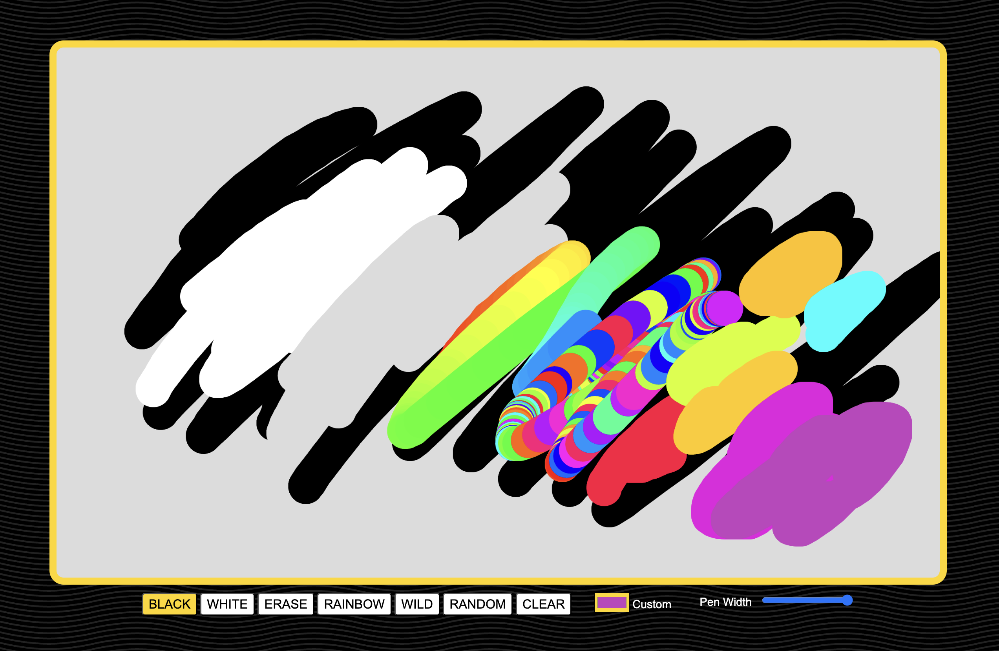

# Project 5

## Goal
Complete the drawing program.

Starter includes:
- black pen color at set width
- clear button and animation
- basic drawing using the keyboard

## Screenshot

## Directions

### Update the Interface: 
- provide form elements to allow a user to select additional styles such as "white" (or "gray"), "erase", "rainbow", "wild" and "random" using form elements -- it should be clear what style is currently chosen
- provide a form element to allow user to adjust line width
- provide a form element to allow user to choose a custom color
- (optional) adjust interface styling

### Expand the Functionality:
- user can now also draw with the mouse
- **white** style draws in white (or optionally you can have the background white and make this a "gray" pen style)
- **erase** style draws in the same color as the canvas background
- **rainbow** style cycles through the hue as user draws
- **wild** style randomly selects a hue each time the mouse is moved
- **random** styles randomly selects a new hue each time the button is clicked or the mouse is clicked to start drawing
- allow user to adjust line width
- allow user to draw with a custom color

## Rubric

| | Maximum Points | Description |
| -----: | :----: | :----- |
| Interface | 20 | Functional form elements, designed for usability, design is similar to the demo |
| Event Listeners | 10 | Form elements each connect to the appropriate function |
| Mouse Draw | 20| User can draw with the mouse within the canvas |
| Line Styles | 10 | White or Grey, Erase |
| Line Styles | 30 | Random, Rainbow and Wild |
| Line Width | 10 | User can select a custom color |
| BONUS | 2 | Style is extra amazing |
| |  |  |
| **Total** | **100** | Completed Project 5 |
